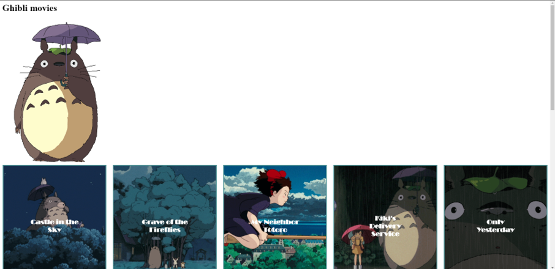

# Progressive Web Apps @cmda-minor-web · 2019-2020

In this course we will convert the client side web application previously made at the OBA into a server side rendered application. We also add functionalities based on the Service Worker and turn the application into a Progressive Web App. Ultimately we are going to implement a series of optimisations to improve the performance of the application.  

## Learning goals
- _You understand the difference between client side and server side rendering and you can apply server side rendering
in your application_
- _You understand how a Service Worker works and you can implement it in your application._
- _You understand how the critical render path works and how you can optimize it for a better runtime and / or perceived performance._

[Rubric](https://docs.google.com/spreadsheets/d/e/2PACX-1vSc48v1nrjcwH0llcTd68xyK7f2fDC2UL4d6h4ZNW3DU8ucez6ZOHiId1XSX0RP5ByvLC8p5pVUGZT4/pubhtml)

## Program

### Week 1 - Server Side Rendering 📡

Goal: Render web pages server side

[Exercises](https://github.com/cmda-minor-web/progressive-web-apps-1920/blob/master/course/week-1.md)  
[Slides](...)  
[The Web landscape](...)  


### Week 2 - Progressive Web App 🚀

Goals: Convert application to a Progressive Web App

[Opdrachten](https://github.com/cmda-minor-web/progressive-web-apps-1920/blob/master/course/week-2.md)  
[Slides](...)


### Week 2 - Critical Rendering Path 📉 

Doel: Optimize the Critical Rendering Path   
[Opdrachten](https://github.com/cmda-minor-web/progressive-web-apps-1920/blob/master/course/week-3.md)  
[Slides](...)

# Studio Ghibli movie discription
<!-- ☝️ replace this description with a description of your own work -->

### introduction
<!-- Add a nice poster image here at the end of the week, showing off your shiny frontend 📸 -->
This site will show you the descriptions of the movies from the famous Ghibli anime studio and show gifs that are from 
the specific ghibli movies. 
### Features
Shows movie description of the studio Ghibli anime studio, with Gifs from the ghibli studio.
## Table of contents
<!-- Maybe a table of contents here? 📚 -->

- [Installation](#Installation)
- [features](#Features)
- [API's](#API)
- [built with](#built-with)
- [Todo](#todo)
- [Nice to have](#Nice-to-have)
- [Advice](#Advice?)
- [Did I have any issues](#Did-I-have-any-issues)
- [What am I proud of/what did I learn](#What-am-I-proud-of/what-did-I-learn)

<!-- ## Live demo
Link to the site: [link](https://heralt.github.io/web-app-from-scratch-1920/)
Add a link to your live demo in Github Pages 🌐-->
## Installation
To install this, you must clone this repo and open it in a IDE of your choice. You then need to generate a key for the 
giphy API and insert it after the ``` api_key=key``` of the fetch URL.  
To install this project, you must clone this repo and open it in a IDE of your choice. You then need to open de project file in your cli
and type 
```console
npm run
```
and then 
```console
npm start
``` 
This will download the dependencies and run the project on http://localhost:3000/.
<!-- Add a link to your live demo in Github Pages 🌐-->

## API
For this project I used two API's, the studio Ghibli and the Giphy API.

#### Ghibli API
The first api that I used for this project is the [Ghibli API](https://ghibliapi.herokuapp.com/#section/Studio-Ghibli-API). This API 
gives you information about 20 studio Ghibli movies. There is no key needed to access the api and there is no request limit.  
##### Installation
To get access to this API you can use the Fetch API. You don't need a key to get access.
#### Giphy API
This API gives you access to tons of different Gif's and stickers.
##### Installation
To get access to this API you need to generate a key on the Giphy website, after that you insert the key that you got 
behind the ``api_key=`` section of the fetch url. You now have access to the Gif's on the site. 

## built with
- [x] Nodemon
- [x] Npm-fetch
- [x] Ejs 
- [x] Npm scripts

## Todo
- [ ] Use Heroku for hosting 
- [ ] Register serviceworker 
- [ ] Add event listeners to serviceworker
- [x] Implement manifest
- [x] make the movie gifs the buttons to the detailpage

## Nice to have
- [ ] Detailpage shows gifs that are linked to the movie name
- [ ] Put in a loading state
- [ ] Create search option

## Advice?
I had a conversation with Declan Tuesday and he gave me some really good advice.

### Did I have any issues 
- I couldn't get my partials to work. 
- I had trouble figuring out what to implement in the app, besides just adding features. The conversation I had with 
declan cleared this up for me. 
- I had issues with retrieving both objects from my ```promise.all()```.

### What am I proud of/what did I learn
- I'm proud of the layout of the site. 
- I learned how to send data from an object to my .ejs files
- How to implement basic npm-scripts
- how retrieve data from multiple api's using promise.all 

<!-- Add a link to your live demo in Github Pages 🌐-->

<!-- ☝️ replace this description with a description of your own work -->

<!-- Add a nice image here at the end of the week, showing off your shiny frontend 📸 -->

<!-- Maybe a table of contents here? 📚 -->

<!-- How about a section that describes how to install this project? 🤓 -->

<!-- ...but how does one use this project? What are its features 🤔 -->

<!-- What external data source is featured in your project and what are its properties 🌠 -->

<!-- Maybe a checklist of done stuff and stuff still on your wishlist? ✅ -->

<!-- How about a license here? 📜 (or is it a licence?) 🤷 -->
