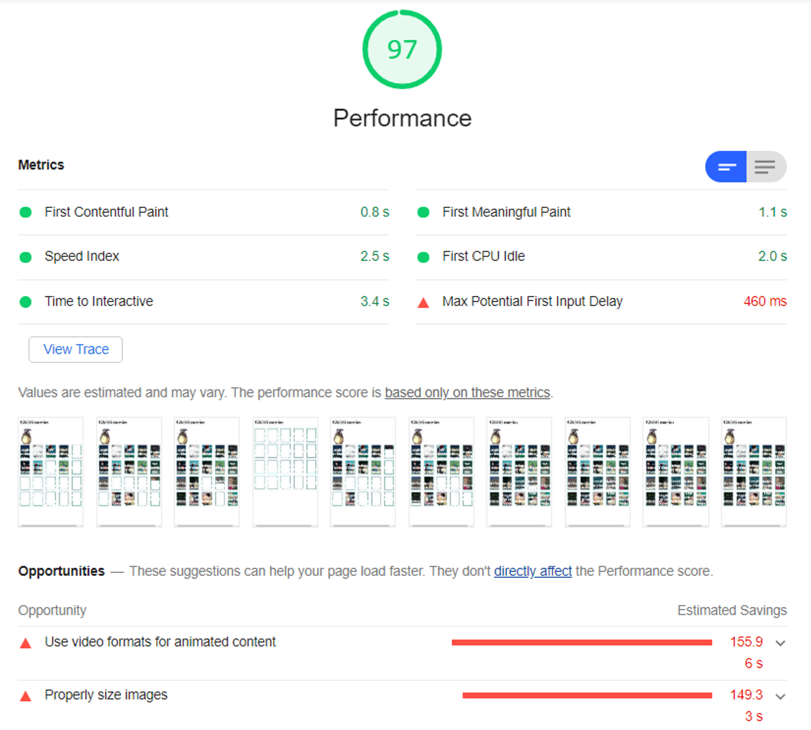
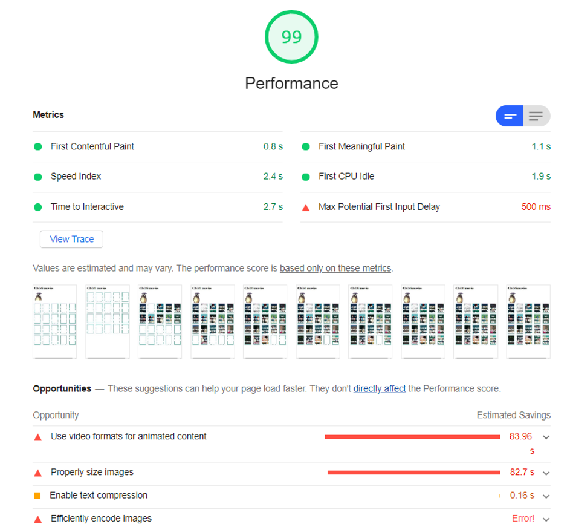
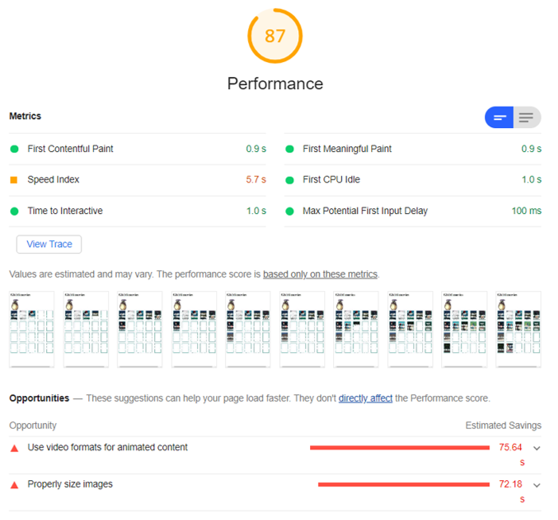
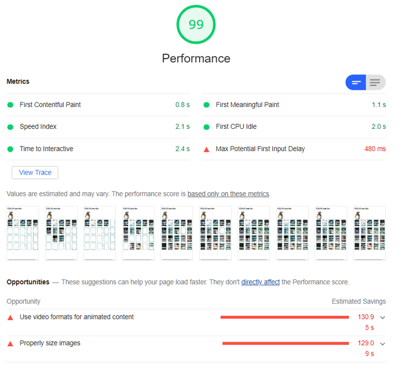
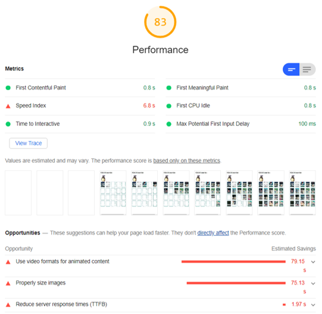
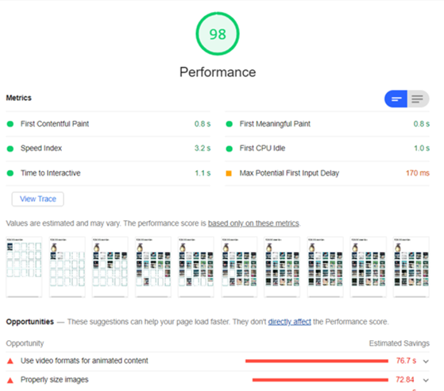

# Progressive Web Apps @cmda-minor-web · 2019-2020

In this course we will convert the client side web application previously made at the OBA into a server side rendered application. We also add functionalities based on the Service Worker and turn the application into a Progressive Web App. Ultimately we are going to implement a series of optimisations to improve the performance of the application.  

## Learning goals
- _You understand the difference between client side and server side rendering and you can apply server side rendering
in your application_
- _You understand how a Service Worker works and you can implement it in your application._
- _You understand how the critical render path works and how you can optimize it for a better runtime and / or perceived performance._

[Rubric](https://docs.google.com/spreadsheets/d/e/2PACX-1vSc48v1nrjcwH0llcTd68xyK7f2fDC2UL4d6h4ZNW3DU8ucez6ZOHiId1XSX0RP5ByvLC8p5pVUGZT4/pubhtml)

## Conclusion
<details>
<summary>Client vs server side renderen</summary>
With server side rendering the client fetches a fully rendered page from the server. With client side rendering, the browser has to do seperate fetches for the css and javascript files. With serverside rendering all of this is done serverside.
<br><br> 
With client side rendering the javascript also runs in the client, which means that if the javascript is turned off fetches will also not be done. With server side rendering, the fetches are done in the server, so turning off the javascript in the client will not cause the fetches to not be done in the server.
<br><br>
This is the biggest benefit I've taken from serverside rendering, turning off the javascript still lets all my fetches work. In the clientside version of this app, the browser would stop fetching if the javascript was turned off. 
</details>

<details>
<summary>Serviceworker</summary>
<br>
A service worker is a service that runs in the background of your site running, and enables you to do different things. For instance, show content even when there is no internet, cache data making the site perform better because it doesn't need to fetch from the server.
<br><br>
What I use my serviceworker for, is to show my own offline page when someone's internet is not working. If the user cannot fetch from the server, they will see the following page:<br> 
  

</details>

<details>
<summary>Critical rendering path</summary>
<br>
The critical rendering path are the steps that need to be taken to show content on the webpage. Roughly explained this means the time it takes to fetch the HTML, the CSS, the JS files and displaying it in the browser of the client to start using. The more efficiently you do this, the faster a user will see content on their page and be able to use your site. This will improve the user experience of your site.
<br><br>
How I've improved my rendering path, is by caching the data on page using browser cache and using a service worker to do the same. This means that if my page hasn't changed and the user comes back to my page, rendering the page goes faster, because a lot of the page data is already cached. This meaning the css and images on the page. 
I have also minified my styles.css, this removes all the unnecessary spaces and comments in the css file, which decreases the file size and the time to fetch and execute the css.
<br><br>
You can also use attributes like defer and async on html script tags. These tags will make sure that the rendering of the page will not get blocked by script tags. Using inline styling on tags also improves page loading time, because no css file needs to be loaded for it.
  
### Before implementing the critical rendering improvements, my audit gave me the following score: 
This is the initial score I got from my performance audit. The score is very good, but thats because the app is very small, so there aren't many components that can slow down the performance of the app.
<br>

<br>
If I just have one improvement to the site performance running, these are the results that I get from the audits:
### Service worker 
<br>


### Implementing browser cache
<br>


### minifying css
<br>


### compressing middleware
<br>


### Final result
I have noticed that compressing the middle decreases the score of the audit, so I turned it off. The time to interactive and speed index are higher if I compress all the responses that come through my middlware. This the final score if every rendering path improvement has been turned on:



What is noticed when I implemented the critical rendering path improvements seperately, some scores improved and some scores become worse. implimenting all the improvements at once, gave a good balance. Overall I have seen the **time to interactive**, **first meaningful paint** and **max potential input delay** improve.

</details>

# Studio Ghibli movie discriptions


### introduction
<!-- Add a nice poster image here at the end of the week, showing off your shiny frontend 📸 -->
This site will show you the descriptions of the movies from the famous Ghibli anime studio and show gifs that are from 
the specific ghibli movies. 

### Features
Shows movie description of the studio Ghibli anime studio, with Gifs from the ghibli studio.
Link naar project: [link](https://ghibliapp.herokuapp.com/).
## Table of contents
<!-- Maybe a table of contents here? 📚 -->

- [Installation](#Installation)
- [features](#Features)
- [API's](#API)
- [built with](#built-with)
- [Todo](#todo)
- [Nice to have](#Nice-to-have)
- [Advice](#Advice?)
- [Did I have any issues](#Did-I-have-any-issues)
- [What am I proud of/what did I learn](#What-am-I-proud-of/what-did-I-learn)

<!-- ## Live demo
Link to the site: [link](https://heralt.github.io/web-app-from-scratch-1920/)
Add a link to your live demo in Github Pages 🌐-->
## Installation
To install this, you must clone this repo and open it in a IDE of your choice. You then need to generate a key for the 
giphy API and insert it after the ``` api_key=key``` of the fetch URL.  
To install this project, you must clone this repo and open it in a IDE of your choice. You then need to open de project file in your cli
and type 
```console
npm run
```
and then 
```console
npm start
``` 
This will download the dependencies and run the project on http://localhost:3000/.
<!-- Add a link to your live demo in Github Pages 🌐-->

## API
For this project I used two API's, the studio Ghibli and the Giphy API.

#### Ghibli API
The first api that I used for this project is the [Ghibli API](https://ghibliapi.herokuapp.com/#section/Studio-Ghibli-API). This API 
gives you information about 20 studio Ghibli movies. There is no key needed to access the api and there is no request limit.  
##### Installation
To get access to this API you can use the Fetch API. You don't need a key to get access.
#### Giphy API
This API gives you access to tons of different Gif's and stickers.
##### Installation
To get access to this API you need to generate a key on the Giphy website, after that you insert the key that you got 
behind the ``api_key=`` section of the fetch url. You now have access to the Gif's on the site. 

## built with
- [x] Nodemon
- [x] Npm-fetch
- [x] Ejs 
- [x] Npm scripts
- [x] Gulp
- [x] Heroku

## Todo
- [x] implement browser cache for CSS  
- [x] implement npm-scripts
- [x] Implement partials 
- [x] Minify CSS 
- [x] Register serviceworker 
- [x] Add event listeners to serviceworker
- [x] Implement manifest
- [x] make the movie gifs the buttons to the detailpage

## Nice to have
- [ ] Detailpage shows gifs that are linked to the movie name
- [ ] Put in a loading state
- [ ] Create search option

## Advice?
I had a conversation with Declan Tuesday and he gave me some really good advice.

### Did I have any issues 
- I couldn't get my partials to work. 
- I had trouble figuring out what to implement in the app, besides just adding features. The conversation I had with 
declan cleared this up for me. 
- I had issues with retrieving both objects from my ```promise.all()```.
- When implementing heroku I had issues with heroku not finding my devdependencies.

### What am I proud of/what did I learn
- I'm proud of the layout of the site. 
- I learned how to send data from an object to my .ejs files
- How to implement basic npm-scripts
- how retrieve data from multiple api's using promise.all 
